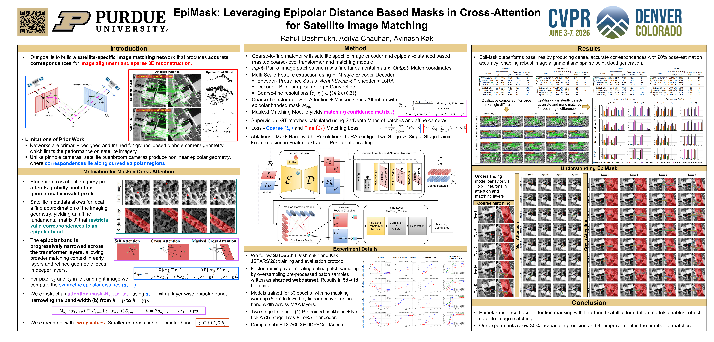

<p align="center">
  <h1 align="center">EpiMask: Leveraging Epipolar Distance Based Masks in Cross-Attention for Satellite Image Matching</h1>
  <p align="center">
  <!-- link to git/linkedin etc -->
    <a href="https://www.linkedin.com/in/rahul-deshmukh-purdue">Rahul Deshmukh</a> |
    <a href="https://www.linkedin.com/in/aditya-chauhan-516b627a/">Aditya Chauhan</a>
  </p>
  <p align="center">
    <a href="https://openaccess.thecvf.com/content/CVPR2026F/papers/Deshmukh_EpiMask_Leveraging_Epipolar_Distance_Based_Masks_in_Cross-Attention_for_Satellite_CVPRF_2026_paper.pdf">Paper</a> |
    <a href="https://arxiv.org/pdf/2603.21463">Preprint</a>
    <!-- <a href="https://satdepth.pythonanywhere.com/">Project Page</a> -->
  </p>
</p>

<p align="center">
  <table>
    <tr>
      <!-- Left column -->
      <td>
        
      </td>
      <!-- Right column with two stacked images -->
    </tr>
  </table>
</p>

---
## Announcements  
- Our work has been accepted for publication in the *IEEE / CVF Conference on Computer Vision and Pattern Recognition Findings (CVPR-F)*. This page will be updated once the DOI becomes available.
- [Sep 2026] Codebase and model weights are now available


<!-- --- -->
<!-- ## TODO
[ ] upload shards satdepth-hw336-128k-rot_aug/train (650 GB) to huggingface for easy access 
---  -->

## Abstract
The deep-learning based image matching networks can now handle significantly larger variations in viewpoints and illuminations while providing matched pairs of pixels with sub-pixel precision. These networks have been trained with ground-based image datasets and, implicitly, their performance is optimized for the pinhole camera geometry. Consequently, you get suboptimal performance when such networks are used to match satellite images since those images are synthesized as a moving satellite camera records one line at a time of the points on the ground. In this paper, we present EpiMask, a semi-dense image matching network for satellite images that (1) Incorporates patch-wise affine approximations to the camera modeling geometry; (2) Uses an epipolar distance-based attention mask to restrict crossattention to geometrically plausible regions; and (3) That fine-tunes a foundational pretrained image encoder for robust feature extraction. Experiments on the SatDepth dataset demonstrate up to 30% improvement in matching accuracy compared to re-trained ground-based models.

---
## Setup
- Clone this repo
- Build the conda environment: `conda env create -f environment.yml && conda activate epimask`
- EpiMask's code uses absolute imports of the form `from epimask.src... import ...`, so it's the repo's **parent** directory that needs to be on `PYTHONPATH`, not the repo root itself (i.e. clone it so the folder is literally named `epimask`, which is the default after `git clone`). All scripts under `scripts/epimask/` already set this up for you. If you're running things outside those scripts (e.g. a notebook), add this to your bashrc instead: `export PYTHONPATH=$PYTHONPATH:<parent-dir-of-epimask-repo>`

<details>
  <summary>[Setup LoFTR]</summary>

  EpiMask uses several modules directly from [LoFTR](https://github.com/zju3dv/LoFTR). The steps for setting up LoFTR are as follows:

  1. Clone the LoFTR repo as follows:

     ```shell
     cd ./scripts/setup_external
     bash ./script/setup_external/setup_loftr.sh
     cd -
     ```
  
  2. LoFTR uses [SuperGluePretrainedNetwork](https://github.com/magicleap/SuperGluePretrainedNetwork) for optimal transport, setup using:

     ```shell
     cd external/LoFTR/src/loftr/utils  
     wget https://raw.githubusercontent.com/magicleap/SuperGluePretrainedNetwork/master/models/superglue.py 
     cd -
     ```

</details>

<details>
  <summary>[Setup Satlas]</summary>

  EpiMask uses the pretrained encoder from [Satlas](https://github.com/allenai/satlaspretrain_models.git). The steps for setting up Satlas are as follows:

  1. Clone the Satlas repo as follows:

     ```shell
     cd ./scripts/setup_external
     bash setup_satlas.sh
     cd -
     ```
</details>

<details>
  <summary>[Setup SatDepth]</summary>

  EpiMask uses modules directly from the [SatDepth](https://github.com/rahuldeshmukh43/satdepth) repo. The steps for setting up SatDepth are as follows:

  1. Clone the SatDepth repo as follows:

     ```shell
     cd ./scripts/setup_external
     bash setup_satdepth.sh
     cd -
     ```

  This clones the repo into `external/satdepth`. EpiMask code imports its classes via `epimask.external.satdepth.src...`. SatDepth's own internal code uses absolute self-imports (e.g. `import satdepth.src.utils...`), and since the clone directory is itself named `satdepth` (not a differently-named package living inside it), it's `external/` -- the clone's *parent* -- that needs to be on `PYTHONPATH`, not `external/satdepth`. `scripts/epimask/*.sh` already add `external/` to `PYTHONPATH` for this reason. If you're running things outside those scripts, add `external/` to `PYTHONPATH` yourself.
</details>

---
## Dataset Download and Prep

<details>
  <summary>[Setup SatDepth Dataset]</summary>

- Download SatDepth dataset as per [SatDepth dataset download instructions](https://github.com/rahuldeshmukh43/satdepth#dataset-download-instructions)
- Setup satdepth dataset splits by following [official instructions](https://github.com/rahuldeshmukh43/satdepth#setup) with replacing `<path-to-satdepth-repo>` to `<path-to-epimask-repo>`. This involves - (1) Creating `<path-to-epimask-repo>/data/satdepth/` folder with train and test indices; (2) Downloading and unzipping the indices; and (3) Creating soft links to the dataset for different AOIs

</details>

<details>
  <summary>[Create sharded webdataset]</summary>

  Training and the `_sharded` test scripts consume the SatDepth dataset in [webdataset](https://github.com/webdataset/webdataset) shard form rather than reading images on the fly. Both flavors of shard are built by a single script, `src/datasets/make_sharded_webdataset.py`, driven by yaml configs under `src/datasets/sharded_dataset_configs/` (no need to edit the Python file) via one of two `.sh` runners in `scripts/epimask/`, selected by the config's `phase`:

  - `phase: train` / `phase: val` -- randomly-sampled patches, oversampled to a target sample count. Built by `scripts/epimask/make_sharded_webdataset.sh`. Configs: `src/datasets/sharded_dataset_configs/jacksonville_{train,val}_{336,448}.yaml`.
  - `phase: test` -- whole-image patches tiled over a DSM grid, one shard set per AOI test pair. Built by `scripts/epimask/make_sharded_webdataset_for_long_testing.sh`. Configs: `src/datasets/sharded_dataset_configs/test_{jacksonville,omaha,ucsd,argentina}_{336,448}.yaml`.

  Each runner builds every config listed in its `CONFIGS` array by default, or a single one when passed a config name, e.g.:

  ```shell
  cd scripts/epimask
  ./make_sharded_webdataset.sh jacksonville_train_336
  ./make_sharded_webdataset_for_long_testing.sh test_ucsd_336
  ```

  To shard a new AOI/split/size, add a yaml under `src/datasets/sharded_dataset_configs/` (copy an existing one) and add its name to the runner's `CONFIGS` array.

  Both scripts write under `data/satdepth/webdataset/` by default (set a different `shard_dir` in the yaml config to point elsewhere, or symlink `data/satdepth/webdataset/` to wherever your shard storage actually lives).
</details>

---
## Model Weights
| Model Name     | Image Size (`img_patch_size`) | Google Drive Link  |
| :-----------:  | :-----: | :-----: |
 | $EpiMask\text{-}LR_{\gamma=0.6}$ | 448 | [link](https://drive.google.com/file/d/1wl0fECVrpTvkBylQEZkKcd348ARUvBCJ/view?usp=drive_link) |
 | $EpiMask\text{-}LR_{\gamma=0.4}$ | 448 | [link](https://drive.google.com/file/d/1Qf2Xk3tYPz7STT9NifW6w40QrrcM9R8X/view?usp=drive_link) |
 | $EpiMask\text{-}HR_{\gamma=0.6}$ | 336 | [link](https://drive.google.com/file/d/1ir6_NDXP1NYh7lwManVWlETg9Xrk7Tqu/view?usp=drive_link) |
 | $EpiMask\text{-}HR_{\gamma=0.4}$ | 336 | [link](https://drive.google.com/file/d/1_Cgphi4DZ5cJ3I99L0zQqZlLZ5FhzoaA/view?usp=drive_link) |

Download a checkpoint from the table above and unpack it under `model_weights/`, e.g. `model_weights/epimask-HR-gamma-pt4-lora32-stage2/` (containing `train_config.yaml` + the `.ckpt` file).

Each model was trained at one fixed image size, given in the table above. When testing a checkpoint, `img_patch_size` and `train_img_size` in the test `.yaml` must both be set to that same size. If they don't match, the model will still run but the results will be wrong.

---
## Running Training, Testing and Demo

<details>
  <summary>[Training]</summary>

  `scripts/epimask/train.yaml` and `scripts/epimask/train.sh` are pre-set to train the stage-1 of $EpiMask\text{-}HR_{\gamma=0.4}$ model (336px, `configs/epimask/sat/epimask-HR-gamma-pt4-stage1.py`). Other model design configs live alongside it under `configs/epimask/sat/`, named after the released checkpoints (`epimask-{HR,LR}-gamma-pt{4,6}-{stage1,lora32-stage2}` -- the `-stage1` configs train the base model, and the `-lora32-stage2` configs LoRA-finetune from a stage-1 checkpoint via `ckpt_path` in `train.yaml`). Edit them (data/model config, GPUs, batch size, log dir) to match your setup, then:

  ```shell
  cd scripts/epimask
  ./train.sh
  ```

  For a Slurm cluster, use `sbatch run_train.sbatch` instead (edit the partition/resource/conda-activation lines for your cluster first).
</details>

<details>
  <summary>[Testing]</summary>

  Three test entry points are provided, each with a matching `.sh` runner and `.yaml` config under `scripts/epimask/`:

  - `test_epimask.py` / `test_epimask.sh` -- on-the-fly evaluation from a pairlist CSV.
  - `test_epimask_sharded.py` / `test_epimask_sharded.sh` -- evaluation from a pre-built whole-image test webdataset (see "Create sharded webdataset" above).
  - `test_epimask_simulated_rot.py` / `test_epimask_simulated_rot.sh` -- evaluation under simulated viewpoint rotation.

  All three `.yaml` configs are pre-set to evaluate the released $EpiMask\text{-}HR_{\gamma=0.4}$ checkpoint (see [Model Weights](#model-weights) below) on Jacksonville. Edit the corresponding `.yaml` (dataset pairlist/shard dir, `ckpt_path`, `model_cfg_path`, `outdir`) to point at a different AOI/checkpoint, then e.g.:

  - `ckpt_path` / `model_cfg_path` must match each other: `model_cfg_path` is the `train_config.yaml` written alongside that checkpoint -- either `training_experiments/<exp_name>/train_config.yaml` for a checkpoint produced by `scripts/epimask/train.sh`, or the `train_config.yaml` bundled with a released checkpoint under `model_weights/<name>/`.
  - `img_patch_size` / `train_img_size` must also match the image size the checkpoint was trained at (see [Model Weights](#model-weights) above, or `SATDEPTH_IMG_RESIZE` in your own `train_config.yaml`). A mismatch here doesn't error out -- it just silently gives you wrong results.
  - `exp_name` is not read by the test scripts -- it's just a label to keep in sync with `ckpt_path`/`model_cfg_path`.
  - `outdir` is just where this test run's outputs (matches, plots, logs, `summary.pkl`) get written -- it can be any directory of your choosing and does not need to be the training run / `model_weights` directory.
  - `test_epimask_simulated_rot.py` also reads a `train_args.yaml` sibling of `model_cfg_path` to sanity-check `img_patch_size`, if present; released `model_weights/` checkpoints don't ship one, so that check is simply skipped for them.

  ```shell
  cd scripts/epimask
  ./test_epimask_sharded.sh testing_set_jacksonville 0
  ```
</details>

<details>
  <summary>[Demo]</summary>

  `notebook/epimask_demo.ipynb` loads a released checkpoint and runs inference on one SatDepth sample pair, with 2D/3D match visualization, per-layer attention maps, and a FLOPs/params report. `notebook/epimask_demo.yaml` controls which checkpoint/sample/thresholds are used -- see its comments.

  **Quickstart:**
  1. Download and unpack a checkpoint under `model_weights/` as described in [Model Weights](#model-weights) above, matching `exp_name`/`ckpt_filename` in `notebook/epimask_demo.yaml`.
  2. Download the [demo shard](https://drive.google.com/file/d/1V60WrTvyRi4ZIBri_1DD_Q79k_KOW-2p/view?usp=drive_link) (4 sample pairs from AOI 144, pre-extracted from the full SatDepth webdataset so you don't need the full multi-GB dataset just to try the notebook): . Unzip it so the `.tar` file(s) resolve to `data/satdepth/webdataset/satdepth-demo/*.tar`.
  3. Open `notebook/epimask_demo.ipynb` in Jupyter/VSCode with its working directory set to `notebook/` (the default), and run all cells top to bottom.

  `sample_idx` in the yaml indexes into the demo shard (0-3); change it and re-run from "Load one data sample" onward to visualize a different pair. To instead run against the full dataset, set `shard_subdir` to `<dataset-name>/<aoi>` per "Setup SatDepth Dataset" above and adjust `shard_size_val`/`sample_idx` accordingly.
</details>

---
## Cite

Please cite our work if you find it useful:

```bibtex
@ARTICLE{Deshmukh2026CVPR,
    author={Deshmukh, Rahul and Chauhan, Aditya and Kak, Avinash},
    title={EpiMask: Leveraging Epipolar Distance Based Masks in Cross-Attention for Satellite Image Matching},
    booktitle={Proceedings of the IEEE/CVF Conference on Computer Vision and Pattern Recognition (CVPR) Findings},
    month={June},
    year={2026},
    pages={6271-6280}
}
```
